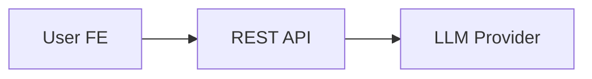
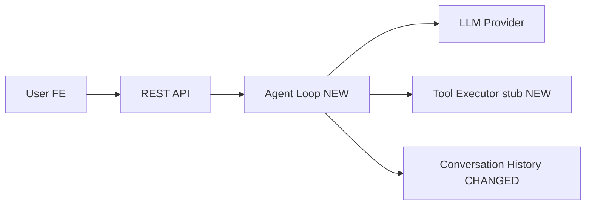

# Incremental Implementation

**Asking questions:** At every checkpoint, use the `AskUserQuestion` tool (available in Claude Code, Codex, and compatible clients) to present structured choices rather than just asking in plain text. This keeps the user in a tight feedback loop without waiting for a new turn. If `AskUserQuestion` is not available in your environment, fall back to asking in plain text.

The goal is to keep the user informed and in control at every step. Large implementations go wrong not because the code is bad, but because the user doesn't understand what was built or why. This skill counters that by breaking work into verifiable units, explaining intent before coding, and showing a clear "what just changed and why" after each chunk.

## Step 1: Read and Internalize the Plan

Read the full plan before doing anything else. If it isn't shared, ask the user to provide it (a file path, a paste, or a description is fine).

As you read, identify:
- The major components, modules, or layers to be built
- Dependencies between them (what must exist before what)
- Natural "seams" — places where something will visibly work after the chunk is done

## Step 2: Propose a Chunk Breakdown

Before writing a single line of code, show the user how you plan to slice the work.

Present it clearly, for example:

```
Proposed implementation chunks:

[1] Project scaffold — folder structure, tsconfig, package.json, dev tooling
[2] Storage layer — JSON file read/write, conversation index
[3] LLM provider interface — abstract interface + first adapter (e.g. Anthropic)
[4] Agentic loop skeleton — basic chat, no tools yet
[5] Built-in tools — web_search, web_fetch, load_skill
[6] MCP client integration — connect to MCP servers, merge tool list
[7] REST API + SSE streaming — Express routes, streaming responses

Chunk 4 depends on 2 and 3. Chunks 5–6 depend on 4. Chunk 7 depends on all.
```

Use the `AskUserQuestion` tool to ask: "Does this breakdown look right? Anything you'd re-slice or re-order?" with options like "Looks good, let's start", "I'd like to re-slice", "Re-order some chunks", or "Other".

Wait for the user to confirm before starting.

## Step 2b: Initialize progress.md

Once the chunk breakdown is confirmed, create a `progress.md` file in the project root (or alongside the plan file if one was provided). This file is the implementation log — it will be updated after every chunk.

Seed it with the plan overview and chunk list:

```markdown
# Implementation Progress

## Plan Overview
[1–3 sentence summary of what's being built]

## Chunks
- [ ] [1] Chunk name — brief description
- [ ] [2] Chunk name — brief description
...

---
```

## Step 3: Work Through Each Chunk

For each chunk, follow this sequence — every time, without skipping steps.

### 3a. Brief the user

In 2–4 sentences: what you're about to build, which files you'll create or modify, and what this chunk connects to. No code yet — just intent. This gives the user a chance to redirect before any work is done.

### 3b. Clarify

Use the `AskUserQuestion` tool to ask if the user has any questions or wants to adjust the approach for this chunk. Offer options like "Looks good, proceed", "I have a question", or "Adjust the approach". One short exchange is enough. If they want to dig into something, take the time — the whole point is that they stay oriented. Don't rush past this.

### 3c. Implement

Write the code. Stay focused on what the chunk describes. Resist the urge to clean up adjacent code, add extra features, or sneak in improvements that weren't part of the plan — those belong in their own chunks.

### 3d. Visualize and Log

After implementation, show the user what was built **and append the chunk's entry to `progress.md`**.

**Choose a Mermaid diagram type** that best communicates the change:

- **`graph LR`** — data flow, request paths, module dependencies
- **`sequenceDiagram`** — request/response cycles, multi-step logic, API calls
- **`classDiagram`** — object relationships, interface hierarchies
- **`flowchart TD`** — conditional logic, branching decision trees

Always show a **before** diagram (what existed prior) and an **after** diagram (what exists now). If nothing existed before, label the before section "Before: nothing" and skip the diagram.

Mark new nodes with a `:::new` CSS class or a `(NEW)` label suffix. Mark modified nodes with `(CHANGED)`.

**Append to `progress.md` after each chunk:**

```markdown
---

## Chunk [N]: [Chunk Name]

**Status:** ✅ Complete
**Files changed:** `src/agent/loop.ts` (created), `src/providers/base.ts` (created)

### What changed
[2–4 sentences explaining what was built, what problem it solves, and how it connects to neighboring chunks.]

### Before

[Mermaid diagram of the system state before this chunk, OR "Before: nothing" if this is the first chunk]

### After

[Mermaid diagram showing the full updated system with new/changed elements labeled]

### Data / Logic Flow

[Optional: a sequence or flowchart diagram walking through how data moves through what was just built. Use this when the "after" structural diagram doesn't capture runtime behavior well.]
```

**Example entry:**

````markdown
---

## Chunk 4: Agentic Loop Skeleton

**Status:** ✅ Complete
**Files changed:** `src/agent/loop.ts` (created), `src/agent/types.ts` (created)

### What changed
Introduced the core agentic loop that drives multi-turn conversations. It receives a user message, appends it to history, calls the LLM, and streams the response. Tool execution is stubbed — it will be wired in Chunk 5.

### Before



### After



### Data / Logic Flow

```mermaid
sequenceDiagram
  participant FE as User FE
  participant API as REST API
  participant Loop as Agent Loop
  participant LLM as LLM Provider

  FE->>API: POST /messages
  API->>Loop: run(message, history)
  Loop->>LLM: chat(history + message)
  LLM-->>Loop: stream tokens
  Loop-->>API: streamed response
  API-->>FE: SSE chunks
```
````

Keep the inline chat summary brief — the `progress.md` entry is the durable record. Don't duplicate all the diagram content in chat; a short prose summary and a pointer ("see progress.md for diagrams") is enough.

### 3e. Verify

Use the `AskUserQuestion` tool to ask: "Does this look right before we move on to [next chunk name]?" with options like "Yes, move on", "I have a question", "Fix something first", or "Other".

Give the user a real chance to inspect, question, or push back. Only move forward when they confirm. If they spot an issue, fix it now — not in a later chunk.

---

## Chunking Heuristics

A well-sized chunk:
- Covers a single layer or abstraction (e.g., "the storage layer", "the provider interface")
- Produces something observable after it's done (a test passes, a route responds, a file is readable)
- Touches 1–4 files

A chunk is probably too big if:
- Its description needs "and also" more than twice
- It creates more than 5 new files at once
- You'd struggle to explain it clearly in 3 sentences

A chunk is too small if:
- It's a single type definition or one-liner
- It produces nothing observable on its own

When in doubt, err toward smaller chunks — the user can always say "combine these two."

---

## Handling Surprises Mid-Chunk

If you discover something unexpected mid-implementation — a missing dependency, a design conflict, something the plan didn't account for — pause and surface it rather than quietly working around it. Explain what you found and why it matters, then use the `AskUserQuestion` tool to ask how the user wants to handle it (e.g. "Update the plan", "Work around it", "Skip for now", "Other").

Same for plan errors: if something in the plan doesn't make sense or conflicts with something already built, flag it before implementing. It's far easier to change direction at the start of a chunk than to untangle it at the end.

---

## Wrapping Up

After all chunks are verified:

1. **Finalize `progress.md`** — append a closing section:

```markdown
---

## Final System Overview

### Architecture

[A single Mermaid diagram showing the complete system as built — all layers, modules, and data flows]

### Summary
[3–5 bullets: what was built, how pieces connect, what to do next]
```

2. **Give a brief inline summary** in chat:
   - What was built across the whole implementation
   - How the major pieces connect to each other
   - What to do next (how to run it, what's missing, what's a natural next phase)

The `progress.md` file is the durable artifact the user can keep, share, or reference later. The inline summary is just a pointer to orient them in the moment.

---

## Staying Grounded

The sequential verification loop is the point of this skill. Don't skip ahead to chunk 5 before chunk 3 is verified, even if it seems like it would save time. The user's understanding is worth more than speed.