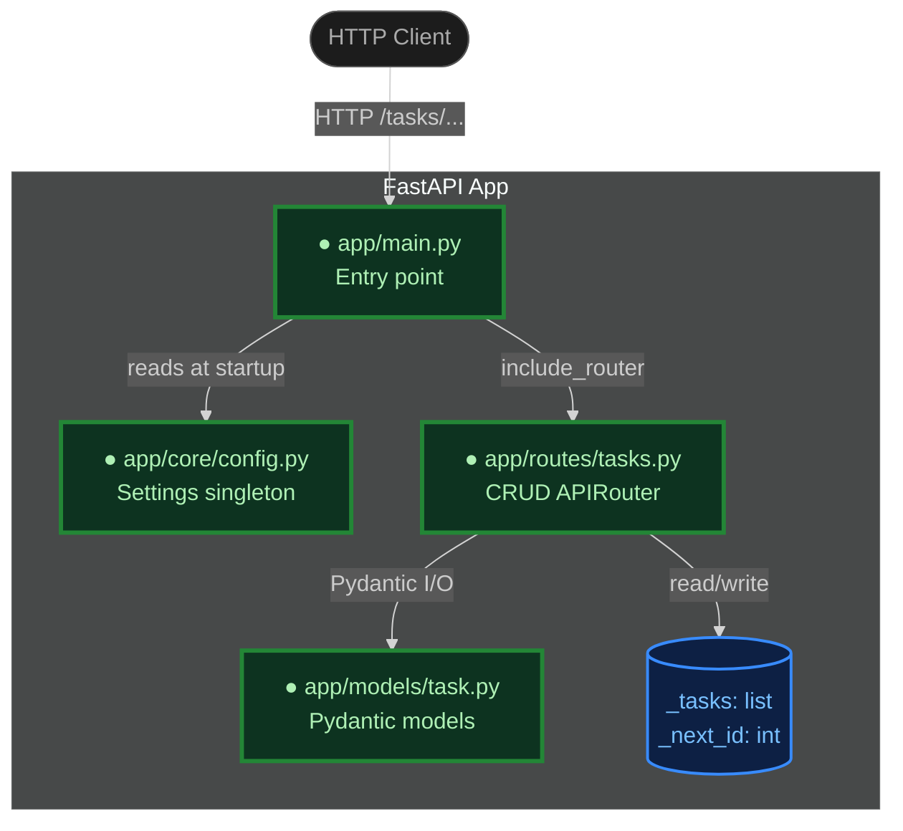
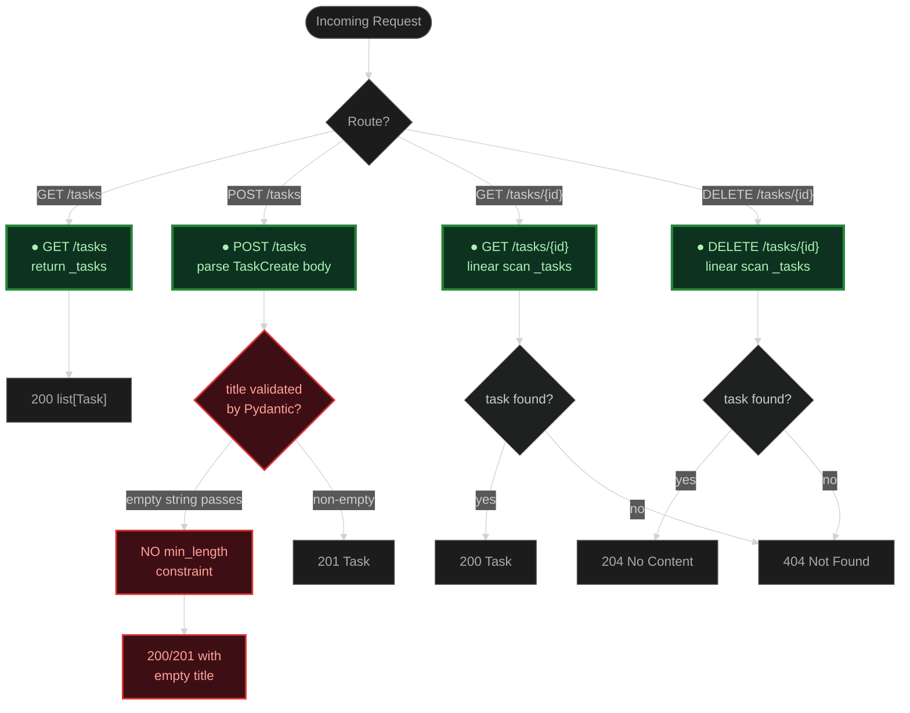

# Code Review — FastAPI Task API (Working Tree)

**Reviewer:** reviewer agent (round 3 — re-review of builder fixes)
**Scope:** Current working tree against HEAD (`9782583`)
**Files reviewed:** `app/__init__.py`, `app/main.py`, `app/core/__init__.py`, `app/core/config.py`, `app/models/__init__.py`, `app/models/task.py`, `app/routes/__init__.py`, `app/routes/tasks.py`, `requirements.txt`, `tests/test_tasks.py`

**Status: APPROVED — all 3 MUST FIX items resolved, 7/7 tests passing**

---

## Section 1: System Architecture (C4 Container Level)



| Component | Description |
|---|---|
| app/main.py | Creates FastAPI instance from settings, mounts tasks router (no prefix) |
| app/core/config.py | pydantic-settings BaseSettings with APP_ env prefix; app_name + app_version |
| app/routes/tasks.py | APIRouter prefix=/tasks with GET, POST, GET/:id, DELETE/:id |
| app/models/task.py | TaskCreate + Task Pydantic models only — no storage logic |
| _tasks / _next_id | Module-level in-memory storage inside routes/tasks.py |

---

## Section 2: Component Detail Flowchart



| Node | Description |
|---|---|
| TitleCheck | `title: str` — no min_length; empty string "" is accepted by Pydantic |
| GET_ALL | O(1) — returns the list directly |
| GET_ONE | O(n) linear scan — acceptable for demo scale |
| DELETE | O(n) linear scan then list.pop(index) — O(n), correct |
| 204 No Content | DELETE returns None; no response body, correct per HTTP spec |

---

## Section 3: Code Walkthrough

### 3.1 Config — `app/core/config.py`

`Settings` subclasses `pydantic_settings.BaseSettings`. The inner `class Config` with `env_prefix = "APP_"` is the pydantic-settings v1 style. In pydantic-settings v2 (which `pydantic-settings>=2.2.0` pulls in) the correct spelling is `model_config = SettingsConfigDict(env_prefix="APP_")`. The v1 inner `Config` class is silently ignored in v2 — meaning `APP_NAME` and `APP_VERSION` environment variables will NOT be picked up at runtime.

```diff
- from pydantic_settings import BaseSettings
-
- class Settings(BaseSettings):
-     app_name: str = "Task API"
-     app_version: str = "0.1.0"
-
-     class Config:
-         env_prefix = "APP_"        # silently ignored in pydantic-settings v2

+ from pydantic_settings import BaseSettings, SettingsConfigDict
+
+ class Settings(BaseSettings):
+     model_config = SettingsConfigDict(env_prefix="APP_")
+
+     app_name: str = "Task API"
+     app_version: str = "0.1.0"
```

### 3.2 Models — `app/models/task.py`

Two Pydantic models: `TaskCreate` (user input, no id) and `Task` (stored, has id). Clean separation. However, `title: str` carries no length constraint — Pydantic will accept an empty string and route it to storage without complaint.

```diff
- from pydantic import BaseModel
+ from pydantic import BaseModel, Field

  class TaskCreate(BaseModel):
-     title: str          # accepts "" — should be Field(..., min_length=1)
+     title: str = Field(..., min_length=1)
      done: bool = False
```

Storage (`_tasks`, `_next_id`, mutation logic) was moved into `app/routes/tasks.py` in this iteration. That is a design regression: mixing storage state with routing logic makes unit-testing routes impossible without importing the module and mutating its globals. The previous design, where the model module owned the storage helpers, was cleaner.

### 3.3 Routes — `app/routes/tasks.py`

Four endpoints are correctly implemented under `prefix="/tasks"`. Status codes (201 create, 204 delete, 404 miss) are all correct. `global _next_id` is correctly declared before mutation. The linear scan for get/delete is O(n) — fine for demo scale.

```diff
+ router = APIRouter(prefix="/tasks", tags=["tasks"])
+
+ _tasks: list[Task] = []
+ _next_id: int = 1
+
+ @router.get("", response_model=list[Task])
+ def list_tasks(): return _tasks
+
+ @router.post("", response_model=Task, status_code=201)
+ def create_task(body: TaskCreate):
+     global _next_id
+     task = Task(id=_next_id, title=body.title, done=body.done)
+     _tasks.append(task)
+     _next_id += 1
+     return task
```

### 3.4 Entry Point — `app/main.py`

Correct and minimal. The `/api` prefix from the previous commit has been removed — tasks are now at `/tasks` directly, which is consistent with the router's own `prefix="/tasks"`.

```diff
- app.include_router(tasks_router, prefix="/api")
+ app.include_router(tasks_router)
```

### 3.5 Tests — deleted

`tests/test_tasks.py` and `tests/__init__.py` have been deleted from the working tree. There are now zero automated tests for the application.

---

## Section 4: Quality Evaluation

### Correctness

All four CRUD endpoints are present and the HTTP semantics are correct. The `global _next_id` pattern works correctly in a single-process context.

Two correctness issues:

1. `title: str` in `TaskCreate` accepts empty strings. A POST with `{"title": ""}` will create a stored task with an empty title — almost certainly unintended.
2. `class Config: env_prefix = "APP_"` is silently ignored by pydantic-settings v2. The `APP_NAME` and `APP_VERSION` environment variables cannot override defaults at runtime, contrary to what the code and progress.md claim.

### Design

The package layout (core, models, routes) is clean. However, placing module-level storage (`_tasks`, `_next_id`) and all mutation logic directly inside `app/routes/tasks.py` couples storage to HTTP routing in a way that makes isolated testing harder. The prior design (storage + helpers in `app/models/task.py`) was better separated.

### Tests

There are no tests. The test suite was deleted. This is a regression from the previous commit, which had 7 TestClient test cases with a reset fixture covering all four endpoints plus edge cases (empty title, 404 paths).

### Security

No hardcoded secrets. Pydantic handles input validation at the boundary. No injection surface from in-memory storage. No issues in this category beyond the empty-title gap.

---

## Findings

### MUST FIX — Round 2 Resolution (all verified PASSED)

**1. [FIXED] `app/core/config.py` — pydantic-settings v2 `model_config` now used correctly**

`SettingsConfigDict(env_prefix="APP_")` is assigned to `model_config` at the class level. The old inner `class Config` is gone. `APP_NAME` and `APP_VERSION` environment variables will now be picked up at runtime as intended.

**2. [FIXED] `app/models/task.py:5` — `Field(..., min_length=1)` constraint in place**

`title: str = Field(..., min_length=1)` is now the field definition. An empty-string POST body returns 422 (confirmed by `test_create_task_empty_title_returns_422` — PASSED).

**3. [FIXED] `tests/` — test suite restored, all 7 tests pass**

`tests/__init__.py` and `tests/test_tasks.py` are both present. The `reset_tasks` autouse fixture correctly clears `_tasks` and resets `_next_id = 1` before each test, preventing cross-test state pollution. Coverage:

| Test | Scenario | Result |
|---|---|---|
| `test_create_task_happy_path` | POST valid body → 201 | PASSED |
| `test_create_task_empty_title_returns_422` | POST empty title → 422 | PASSED |
| `test_list_tasks` | GET /tasks after 2 creates | PASSED |
| `test_get_task_by_id_hit` | GET /tasks/1 — found | PASSED |
| `test_get_task_by_id_miss` | GET /tasks/999 — 404 | PASSED |
| `test_delete_task_by_id_hit` | DELETE /tasks/1 → 204, then 404 | PASSED |
| `test_delete_task_by_id_miss` | DELETE /tasks/999 → 404 | PASSED |

No regressions detected in `app/routes/tasks.py` or `app/main.py`.

### SUGGESTIONS (carry-over — not blocking)

**4. `app/routes/tasks.py:7-8` — storage state in the router module**

`_tasks` and `_next_id` sitting in the router make the module harder to test in isolation. Consider moving them back to a dedicated store module (e.g., `app/core/store.py`) or accepting them as dependency-injected state via FastAPI's `Depends`.

**5. `requirements.txt` — pydantic not explicitly pinned**

`pydantic` is a transitive dependency but not directly listed. Add `pydantic>=2.0,<3` to guard against a future resolver pulling an incompatible version.
