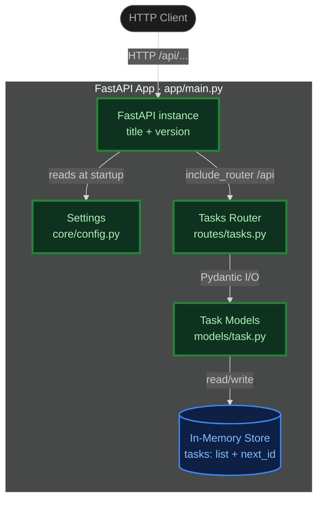
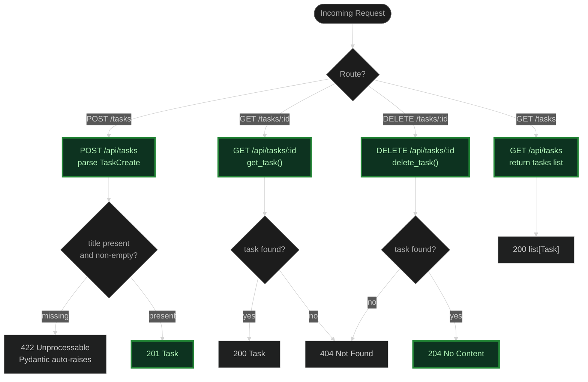

# Code Review — FastAPI Task Tracker (Init)

**Scope:** Full initial implementation from `plan.md`.
**Files created:** `app/main.py`, `app/core/config.py`, `app/models/task.py`, `app/routes/tasks.py`, `requirements.txt`

---

## Section 1: System Architecture (C4 Container Level)



**Legend**

| Style | Meaning |
|---|---|
| Dark green border | New component |
| Blue border | Data source / store |
| Grey | External |

---

## Section 2: Component Detail Flowchart



**Endpoint Summary**

| Endpoint | Input | Response model | Status codes |
|---|---|---|---|
| `GET /api/tasks` | — | `list[Task]` | 200 |
| `POST /api/tasks` | `TaskCreate` body | `Task` | 201, 422 |
| `GET /api/tasks/{id}` | path `int` | `Task` | 200, 404 |
| `DELETE /api/tasks/{id}` | path `int` | — | 204, 404 |

---

## Section 3: Code Walkthrough

### 3.1 Config — `app/core/config.py`

`Settings` subclasses `pydantic_settings.BaseSettings`. Both fields carry string defaults so the app boots without any environment variables. Because `BaseSettings` reads from the environment automatically, `APP_NAME` and `APP_VERSION` env vars will override the defaults at runtime — a clean twelve-factor pattern with zero extra code.

```diff
+ from pydantic_settings import BaseSettings
+
+ class Settings(BaseSettings):
+     app_name: str = "Task Tracker API"
+     app_version: str = "0.1.0"
+
+ settings = Settings()
```

### 3.2 Models + storage — `app/models/task.py`

Two Pydantic models: `TaskCreate` (input, no id) and `Task` (stored, has id). Storage is a module-level list and integer counter. `add_task` appends and bumps the counter. `get_task` does a linear scan with `next()`. `delete_task` calls `get_task` then `list.remove()`.

```diff
+ class TaskCreate(BaseModel):
+     title: str
+     done: bool = False
+
+ class Task(BaseModel):
+     id: int
+     title: str
+     done: bool = False
+
+ tasks: list[Task] = []
+ next_id: int = 1
+
+ def add_task(data: TaskCreate) -> Task: ...
+ def get_task(task_id: int) -> Task | None: ...   # O(n) linear scan
+ def delete_task(task_id: int) -> bool: ...       # get_task + list.remove = O(2n)
```

### 3.3 Routes — `app/routes/tasks.py`

An `APIRouter` registers four endpoints. POST relies on FastAPI's Pydantic body parsing (422 on bad input is automatic). DELETE correctly returns `204` with no body. GET by id and DELETE both raise `HTTPException(404)` on a miss.

```diff
+ router = APIRouter()
+
+ @router.get("/tasks", response_model=list[Task])
+ def list_tasks(): return tasks
+
+ @router.post("/tasks", response_model=Task, status_code=201)
+ def create_task(data: TaskCreate): return add_task(data)
+
+ @router.get("/tasks/{task_id}", response_model=Task)
+ def read_task(task_id: int):
+     task = get_task(task_id)
+     if not task:
+         raise HTTPException(status_code=404, detail="Task not found")
+     return task
+
+ @router.delete("/tasks/{task_id}", status_code=204)
+ def remove_task(task_id: int):
+     if not delete_task(task_id):
+         raise HTTPException(status_code=404, detail="Task not found")
```

### 3.4 Entry point — `app/main.py`

`FastAPI` is instantiated with `title` and `version` drawn from `settings`, then the tasks router is mounted at `/api`. Minimal and correct.

```diff
+ app = FastAPI(title=settings.app_name, version=settings.app_version)
+ app.include_router(tasks_router, prefix="/api")
```

### 3.5 Requirements — `requirements.txt`

Three pinned dependencies. Versions are explicit, which is good for reproducibility.

```diff
+ fastapi==0.115.0
+ uvicorn==0.32.0
+ pydantic-settings==2.6.0
```

---

## Section 4: Quality Evaluation

### Correctness

All four endpoints from the plan are present and correctly wired. Pydantic handles body validation on POST. 404 is raised correctly on GET and DELETE misses. 204 (no body) on DELETE is correct REST semantics. The `global next_id` pattern is correct for single-process in-memory use.

### Design

Separation of concerns is clean: config, models, routes, and entry point are in distinct modules. Using Pydantic models as the storage unit is idiomatic FastAPI. The plan specified `id, title, done` — the implementation matches exactly. No over-engineering.

### Security

No hardcoded secrets. `BaseSettings` supports env-var override without code changes. Input validation is handled by Pydantic. No injection surface given in-memory storage.

---

## Issues

### MUST FIX

**1. `app/models/task.py:4` — empty title accepted**
`title: str` on `TaskCreate` accepts `""`. Pydantic will not reject it, so `POST /api/tasks` with `{"title": ""}` silently creates a task. Add a `min_length` constraint:

```python
from pydantic import BaseModel, Field

class TaskCreate(BaseModel):
    title: str = Field(..., min_length=1)
    done: bool = False
```

**2. `app/models/task.py:16-17` — module-level singleton makes tests share state**
`tasks` and `next_id` are process-global. Every test that creates a task pollutes the store for subsequent tests. There is no reset mechanism. If tests are added later (see item 3), they will produce non-deterministic results depending on run order. The store should either be encapsulated in a class and injected via a FastAPI dependency, or the test fixture must clear the list and reset the counter between tests. A minimal fix:

```python
# app/models/task.py — replace module-level vars with a reset helper for tests
def _reset_store():
    global tasks, next_id
    tasks.clear()
    next_id = 1
```

A cleaner fix is a `TaskStore` class (matching the pattern in `eval/fixture-app/`) injected via `Depends`.

**3. No tests**
The plan does not explicitly require tests, but there is no way to verify the endpoints work without them. Add `tests/test_tasks.py` using FastAPI's `TestClient`:

```python
from fastapi.testclient import TestClient
from app.main import app

client = TestClient(app)

def test_create_and_list(): ...
def test_get_not_found(): ...
def test_delete(): ...
def test_delete_not_found(): ...
def test_empty_title_rejected(): ...  # verifies MUST FIX #1
```

### SUGGESTIONS

**4. `app/models/task.py:28-29` — O(n) lookup, O(2n) delete**
`get_task` scans the list linearly; `delete_task` calls it then calls `list.remove` (another scan). A `dict[int, Task]` keyed by id makes both O(1) — the same structure used in `eval/fixture-app/src/models/task.py`. Worth the trivial refactor even at small scale.

**5. `requirements.txt` — pydantic not pinned**
`pydantic` is a transitive dependency of both `fastapi` and `pydantic-settings` but is not pinned. A future resolver could pull in an incompatible version. Add `pydantic>=2.0,<3`.

**6. No startup instructions**
There is no `if __name__ == "__main__"` block and no README section on how to run the server. A one-liner comment in `app/main.py` or a README entry (`uvicorn app.main:app --reload`) would help.

